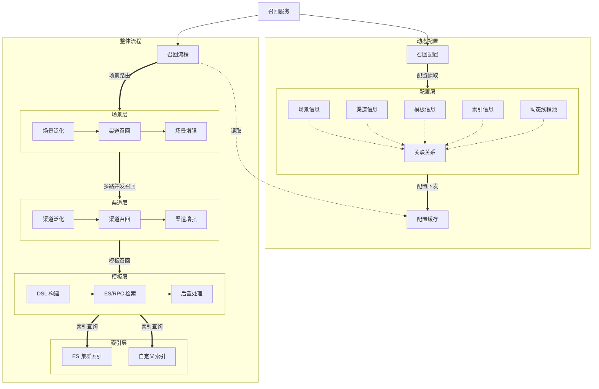

# 轻量化召回引擎实现

## 概述
轻量化召回引擎实现，自定义召回流程配置，支持es、rpc等物料召回模式

## 整体架构



### 核心模块说明

1. **HTTP接口层**
    - 提供RESTful API接收召回请求
    - 请求参数校验和预处理
    - 响应结果封装

2. **召回服务**
    - 协调召回流程执行
    - 管理召回上下文信息
    - 处理异常和降级逻辑

3. **召回执行器**
    - 执行具体的召回流程
    - 组合多个召回渠道结果
    - 应用场景规则和模板

4. **召回渠道**
    - 实现具体召回策略
    - 支持并行/串行执行
    - 可插拔式设计，易于扩展

5. **结果处理器**
    - 召回结果去重
    - 结果排序和截断
    - 结果格式转换

## 核心概念

### 1. 场景 (Scene)
场景定义了召回发生的具体业务上下文，包含：

- **唯一标识符**：如 "homepage", "product_detail" 等
- **召回策略配置**：该场景下启用的召回渠道
- **业务参数**：场景特定的过滤条件
- **结果要求**：期望返回结果数量、排序规则等

示例场景配置 (YAML格式):
```yaml
scenes:
  homepage:
    channels: ["hot", "personalized", "similar"]
    result_size: 50
    filters:
      - status: ACTIVE
      - category: in [1, 2, 3]
  product_detail:
    channels: ["similar", "frequently_bought"]
    result_size: 20
    filters:
      - exclude_current: true
```

### 2. 渠道 (Channel)
渠道代表一种独立的召回策略实现：

- **热销召回**：基于全局热度排序
- **个性化召回**：基于用户历史行为
- **相似召回**：基于物品相似度
- **协同过滤召回**：基于用户/物品协同矩阵
- **实时行为召回**：基于用户实时行为

渠道实现示例:
```java
@Component
@Channel(name = "hot")
public class HotRecallChannel implements RecallStrategy {
    
    @Override
    public List<Item> recall(RecallContext context) {
        // 从热销池获取热门商品
        return hotItemService.getHotItems(
            context.getScene().getResultSize(),
            context.getFilters()
        );
    }
}
```

### 3. 模板 (Template)
模板提供可复用的召回流程配置：

- **渠道组合模板**：预定义的渠道执行顺序
- **参数化模板**：支持动态参数注入
- **条件化执行**：基于请求参数的渠道选择

模板配置示例:
```yaml
templates:
  default:
    steps:
      - channel: hot
        weight: 0.3
      - channel: personalized
        weight: 0.7
  new_user:
    steps:
      - channel: hot
        weight: 1.0
      - channel: trending
        weight: 1.0
```

## 快速开始

### 环境要求
- Java 17+
- Maven 3.6+
- Redis 5.0+ (用于缓存)
- MySQL 8.0+ (可选，用于存储配置)

### 启动步骤

1. 克隆仓库：
```bash
git clone https://github.com/yourusername/recall-engine.git
```

2. 配置应用参数：
```bash
cp src/main/resources/application-example.yml src/main/resources/application.yml
```

3. 构建项目：
```bash
mvn clean package
```

4. 启动服务：
```bash
java -jar target/recall-engine-1.0.0.jar
```

### API调用示例

**召回请求：**
```http
POST /recall/execute
Content-Type: application/json

{
  "scene": "homepage",
  "userId": "u123456",
  "context": {
    "device": "mobile",
    "location": "Beijing"
  },
  "parameters": {
    "category": "electronics"
  }
}
```

**成功响应：**
```json
{
  "code": 200,
  "data": {
    "scene": "homepage",
    "results": [
      {"itemId": "p1001", "score": 0.92},
      {"itemId": "p1002", "score": 0.89}
    ],
    "channels_used": ["hot", "personalized"]
  }
}
```

## 扩展与定制

### 添加新召回渠道
1. 实现`RecallStrategy`接口
2. 使用`@Channel`注解注册渠道
3. 在场景配置中添加新渠道

```java
@Channel(name = "new_channel")
public class NewRecallChannel implements RecallStrategy {
    
    @Override
    public List<Item> recall(RecallContext context) {
        // 实现自定义召回逻辑
    }
}
```

### 自定义模板解析器
1. 实现`TemplateResolver`接口
2. 重写`resolveTemplate`方法
3. 在配置中指定自定义解析器

```java
@Component
public class CustomTemplateResolver implements TemplateResolver {
    
    @Override
    public RecallTemplate resolveTemplate(String templateName, RecallRequest request) {
        // 实现自定义模板解析逻辑
    }
}
```

## 贡献指南
欢迎提交Pull Request：
1. Fork 本仓库
2. 创建特性分支 (`git checkout -b feature/your-feature`)
3. 提交修改 (`git commit -am 'Add some feature'`)
4. 推送分支 (`git push origin feature/your-feature`)
5. 创建 Pull Request

## License
本项目采用 [Apache License 2.0](LICENSE)

---

**项目维护者**：Your Name  
**联系方式**：your.email@example.com  
**最后更新**：2023年10月15日