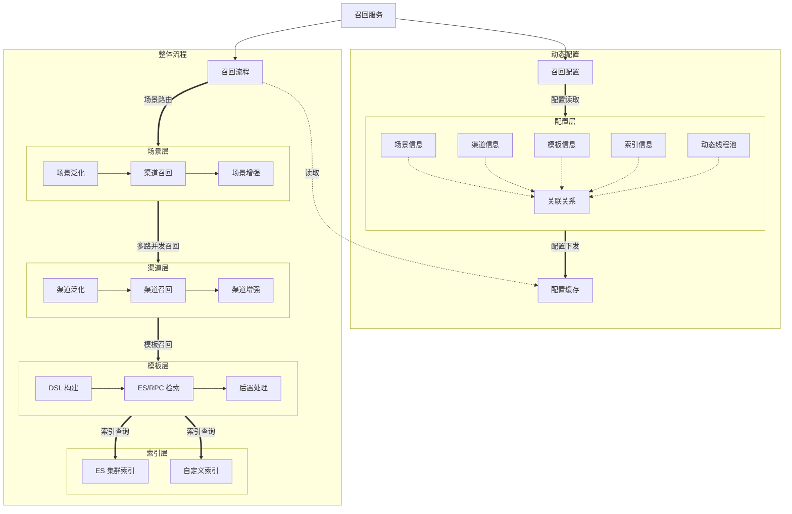

<h1 align="center">轻量化召回引擎实现</h1>


## 概述

轻量化召回引擎实现，自定义召回流程配置，支持es、rpc等物料召回模式

## 整体架构



### 核心模块说明

1. **配置模块**
    - 集成召回所需要的全部配置数据，包括 场景、渠道、模板、索引、线程池 等配置，配置直接通过关联关系数据进行连接
    - 配置信息在应用启动过程中动态注入到缓存中，这种配置下发的方式，可有效的减少召回阶段配置读取的时间
2. **召回流程**
    - 召回流程串联场景、渠道、模板、索引四个节点，通过构建参数、拼接 dsl 并查询 es 获取到所输入条件对应的结果数据，并通过后续增强节点，对结果进行一定的后置处理
3. **资源模块**
    - 本模块定义了统一资源调用的抽象接口，通过资源标识归类不同类型的资源，例如推荐系统中最为常见的 es、rpc、特征等资源类型
    - 统一的资源调用模块，便于进行资源的管理，易于进行不同资源接入时的扩展，易于进行后续统一的打点、监控、回流等
4. **泛化模块**
    - 场景、渠道可关联的泛化节点，对传入参数进行一定的定制处理，以获取符合 es 检索规则的参数结果
5. **增强模块**
    - 场景、渠道可关联的增强节点，用于结果获取后的后置处理，例如后置的对物料结果进行基于时间、得分等的排序，就需要自定义增强节点并接入到召回流程中
6. **规则模块**
    - 构建 dsl 过程所执行的模块，在正向组合模式中，通过获取所配置的 dsl，分片解析其中的规则，并根据各种规则所具有的结构，将参数填充其中

## 核心概念

### 1. 场景

场景定义了召回发生的具体业务上下文，包含：

- **场景标识**：如 "homepage", "product_detail" 等
- **召回策略**：通过关联信息数据，场景可以关联具体的召回路信息，执行多路召回
- **业务参数**：场景执行所需要的参数信息

示例场景配置:

```json
{
  "sceneId": "homeRecommendation",
  "recallNum": 1000,
  "description": "首页推荐场景"
}
```

### 2. 渠道

渠道代表一种独立的召回策略实现，例如召回引擎中常见的：

- **热销召回**：基于全局热度排序
- **个性化召回**：基于用户历史行为
- **相似召回**：基于物品相似度
- **协同过滤召回**：基于用户/物品协同矩阵
- **实时行为召回**：基于用户实时行为

示例渠道配置:

```json
{
   "channelId": "exampleChannel1",
   "recallNum": 200,
   "timeout": 200,
   "description": "示例渠道1"
}
```

### 3. 模板

模板提供可复用的召回流程配置：

- **渠道组合模板**：预定义的渠道执行顺序
- **参数化模板**：支持动态参数注入
- **条件化执行**：基于请求参数的渠道选择

示例模板配置:

```json
{
   "templateId": "exampleTemplate1",
   "description": "示例模板1"
}
```

## 快速开始

### 环境要求

- Java 1.8+
- Maven 3.6+
- Es 7.8+

### 启动步骤

1. 克隆仓库：

```bash
git clone git@github.com:winding-bubu/tech-recommend.git
```

2. 构建项目：

```bash
mvn clean package
```

3. 启动服务：

```bash
java -jar target/tech-recommend-1.0.0.jar
```

## 扩展与定制

### 添加新召回场景

1. 参考 tech-recommend-common/src/main/resources/scene/examplescene，复制一个文件夹，进行自定义场景的配置

## 贡献指南

欢迎提交 Pull Request

## License

本项目采用 [Apache License 2.0](LICENSE)

---

**项目维护者**：起风了布布  
**联系方式**：15764220494@163.com  
**最后更新**：2025年06月08日